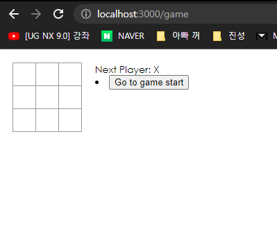
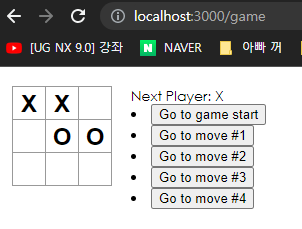

# Tictactoe Game
react자습서의 tictactoe게임을 typescript 버전으로 만들어 본 예제

## 실행 방법
`npm start` 프로그램을 시작
`url path` Open [http://localhost:3000/game](http://localhost:3000/game)

## UI 화면
### 게임을 실행했을 때 화면

### click event 

